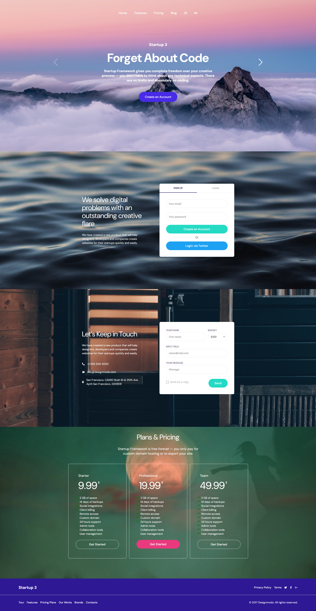

###  Job Darman Interview Task!

<br>

<p align='center'>
  
</p>

<p align='center'>
  Final result
</p>

<br>

<!-- <p align='center'>
<a href="">Live Demo</a>
</p>

<br> -->

## Features

- ⚡️ [React 18](https://beta.reactjs.org/)
- 🦾 TypeScript
- 🫀 [Vit](https://vitjs.dev/) - fast local development server!
- 🎨 [Tailwind with JIT](https://tailwindcss.com/) - next generation utility-first CSS
- 👑 [Atomic Design organization](https://bradfrost.com/blog/post/atomic-web-design/)
- 🗂 [Absolute imports](https://github.com/vitejs/vite/issues/88#issuecomment-762415200)
- [Using Variable Font](https://fonts.google.com/knowledge/introducing_type/introducing_variable_fonts)
- Using Husky & Commit-Lint - structured and unified Git commits

### Coding Style

- Semantic HTML
- [ESLint](https://eslint.org/) - configured for React/Hooks & TypeScript
- [Prettier](https://prettier.io/)

### Dev tools

- [TypeScript](https://www.typescriptlang.org/)
- [Commit lint](https://github.com/conventional-changelog/commitlint) - helps your team adhering to a commit convention

## Usage

### Development

Just run and visit http://localhost:3000/

```bash
yarn dev
```

### Build

To build the App, run

```bash
yarn build
```

And you will see the generated file in `dist` that ready to be served.
